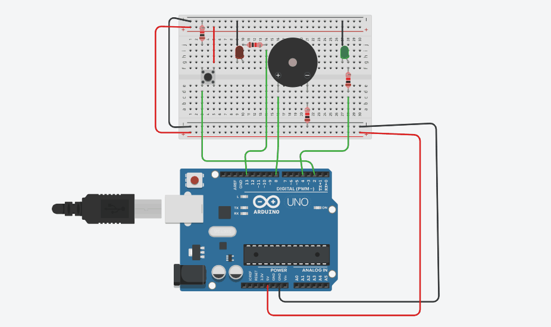
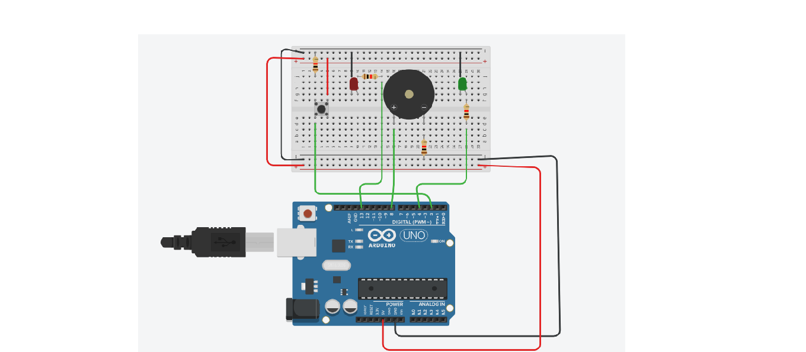

# Automated Alarm System using Arduino Uno

An interrupt-driven alarm system that triggers a buzzer and red LED when a pushbutton is pressed, simulating an urgent event.

### **Demo**

### **How It Works**
By default, the green LED stays ON indicating "Safe/Normal" state. 

When the pushbutton is pressed:
1. An external interrupt is triggered on pin D2
2. Green LED turns OFF
3. Red LED turns ON 
4. Buzzer starts buzzing
5. Pressing the button again resets the system to normal

This uses `attachInterrupt()` for instant response without polling in `loop()`.

### **Components Required**
| Component | Quantity |
| --- | --- |
| Arduino Uno R3 | 1 |
| Red LED | 1 |
| Green LED | 1 |
| 220Ω Resistors | 2 |
| Piezo Buzzer | 1 |
| Pushbutton | 1 |
| 10kΩ Resistor | 1 |
| Breadboard + Jumper Wires | - |

### **Circuit Connections**
| Component | Arduino Pin |
| --- | --- |
| Green LED + | D4 via 220Ω |
| Red LED + | D13 via 220Ω |
| Buzzer + | D8 |
| Pushbutton | D2 |
| All GNDs | GND |

**Note**: Pushbutton uses external interrupt on D2. Use a 10kΩ pull-down resistor.

### **Code**
The full Arduino sketch is in `automated_alarm_system1.ino`. 

Key concept: Hardware interrupt

### **Circuit Diagram**

